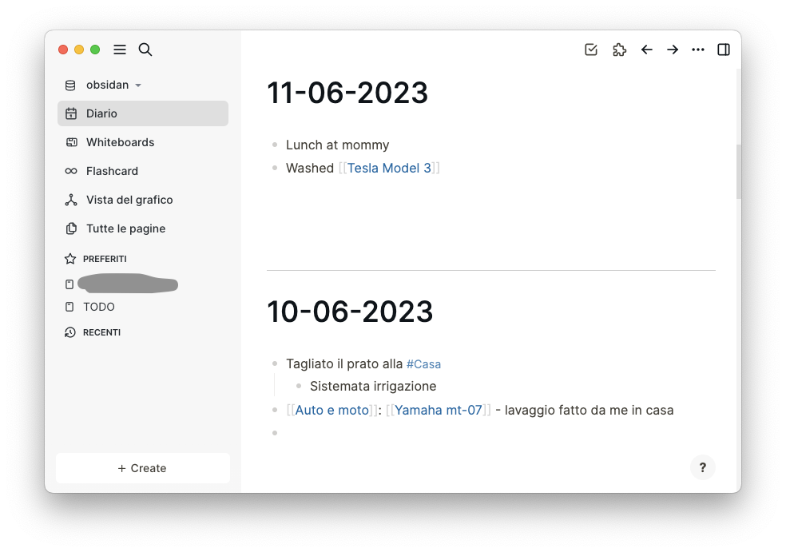
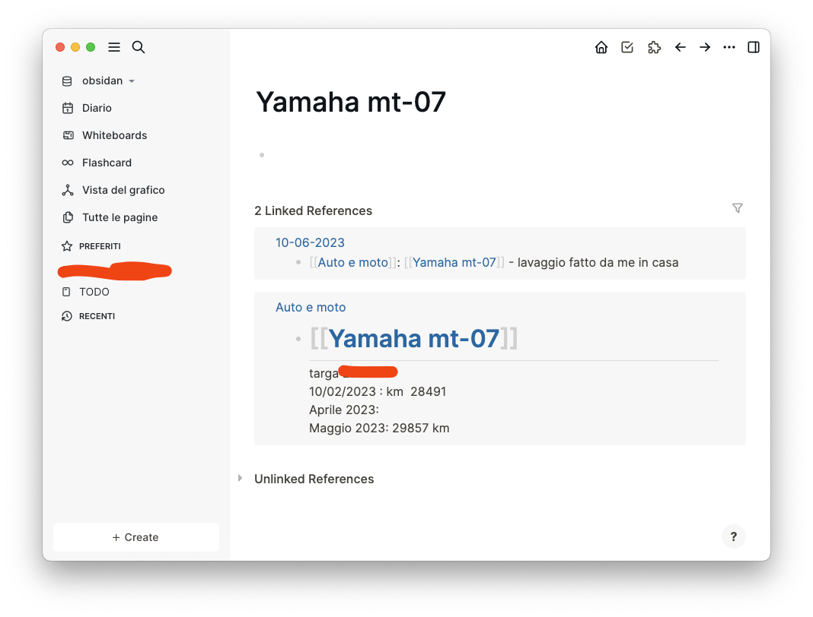

I've gone through many notetaking apps in my life, expecially the open source ones. For my job, a very simple notepad is not enough. Let's compare some of them I've used along the years.

- **Evernote**. Nice app, probably the first real _premium_ one. The drawbacks for me are that it's commercial, it's not open source, it's a locked ecosystem. Tested for a while then I started checking out for alternatives.
- **Google Keep**. Very simple note taking app. For some time it has been my default app. However, it's very limited: I want to do much more with my knowledge.
- **DS Note** - AKA **Synology Note Station**. Synology is a NAS producer and I proudly own a [Synology NAS](/2019/10/27/tips-tricks-from-my-linux-experience.html) at home. I use many Synology services, like [Synology Photos](/from-google-photos-to-synology-photos/), because I want to physically own my data. Sometimes I may write a password, or some thoughs that I don't want to go public. However, DS Note is probably the least loved app by Synology developers. There are a lot of bugs that you hit in a way or another. Plus, the data is not in an exportable format. And you cannot create links. Usability is a mess on mobile devices.
- **Obsidian**. This was my first attempt to use a serious app for note taking. With Obsidian, note taking becomes a _knowledge tracing_ experience. I've used Obsidian with profit over the last year, and there were a couple of features I really liked, like the fact that everything is Markdown (we should give the author of Markdown a Turing Award, lol), files are phisically living on your device, and you can sync with whatever - I sync with my NAS, but others use dropbox etc. Everything looks cool but I have found some shortcomings, like the fact that notes were mostly disconnected, and I kept organizing notes based on directories and subdirectories, which is not optimal.
- **Logseq** - the last tool I'm trying to use. It will be discussed here more in detail. 

## My requirements

- **Files must be mine**. I don't want my notes to live on hardware that is not mine.
- **Markdown**. I want to use Markdown to write my notes. Markdown is a very simple way of writing notes with all the fancy stuff we are used to - bold, italics, tables, images, links, code... - and then it's nicely rendered as html by programs. [This blog is written in Markdown](https://github.com/musikele/blog-eleventy/tree/master/_posts). Once you start using markdown it's impossible to go back.
- **Organize my knowledge**. This is where Obsidian falls short. Obisidian uses a bottom-up approach, so you write the note, and then you connect the note with other pages, which may never happen. My notes were mostly disconnected with very few links.
- **Write Todo lists**, and possibily handle them as a kanban board. I keep juggling many tasks at once (I know it's bad but life is like that), so I need a place to capture what I am working on.
- **Have a journal of my day**. I was not into journaling, but the author of a newletter I am subscribed shared the idea of a "house journal", where he kept writing down things about his house, and his life: when he did renovations, who came to visit, etc. Porting the idea to the computer world, I started to feel the need of a place where I could write down what I was working on, what I was thinking, personal notes, etc.
- **Link all these thoughts with ease**. I want the process of linking stuff together to be totally transparent; I don't want to look for a filename or to phisically create the note; the program should take care of it.
- **search**. Given that it's plain text, this is probably the easiest part that every program is able to do.

## Logseq

The latest addition to the gang is [Logseq](https://logseq.com/). Installing it is a breeze. However, using it like a pro requires some training: that's why it's not a classic, text only, notetaking app.

### The most important features for me

- When you open the app, the first thing you see is today's note. Basically, it's a note with today's date.

- The second thing you'll notice is that everything is a bullet point, which can be indented at your will. This is very handy because it puts in effect the **top-down approach**: it forces you to think in topics.
- the third thing I appreciated is **how easy it is to create pages and links between them**. You only have to write `[[Page name]]` and you get a new page created. This is instantly clickable and you can see in the page all the notes (and bullet points) that link there. Also, you can add more text in the page that is not linked to a daily note, which is great for organizing content! Hashtags work too (e.g. `#PageName`) but you're constrained to not have spaces in your text.

### Other things worth noting

These three features alone made me use LogSeq from day one without regrets. But there is more to the table.

- Being file-based, I could use the same obsidian directory and I automatically got all old notes imported. All previous sync processes I already had in place are just working fine, again. And since everything is cleartext, you don't loose nothing.
- The app has two other features that I'm not using yet, which are **Whiteboards** (the ability to draw on a canvas) and **Cards**, which are a way to structure the content you want to remember.

### Where it falls short

- **TODOs.**. This is the part I feel I am missing something. Currently, you can create a TODO anywhere in the app (daily page, dedicated page...) by simply writing `/TODO`. However, keeping track of these TODOs is complicated because they're scattered all over the pages. (_I am still a first-time user so I may be missing something very obvious._) I'd love to be able to create multiple TODO pages, for example, one for work and another for personal, or hobby tasks; for example, I may have to add in the Work to do "submit expense report" and in the personal todo list "create appointment with doctor". these TODOs may be seen in a dedicated TODO page which can be filtered out by the "category" of the todo (work, personal, hobby...) or all together. This part is complex but probably Logseq developers are hardcore enough to hear my preys.
- **Documentation**. Logseq website is beautiful. But I felt bewildered when the "introduction" part contained a 70 minutes video. I tried to find a simpler, quicker, gentler introduciton with no luck. There are hundreds of guides to tweak everything, there are also use cases by other people that have bended LogSeq to their own workflows, but nothing for the pure starter. Which makes it very hard to understand if I am doing things the proper way or not. I feel that a 5 mins introduction video that goes through the very basics of the application is the missing part.

## Conclusions

It's been 3 weeks that I am using LogSeq only and I feel my notetaking has taken a new level. My notes are finally connected, everything is easily reachable and searchable. I am now randomly adding things that normally I wouldn't add just because I want them to appear when connected to other notes. I am also mixing personal with work stuff because I feel that the diary page has an immense power on fixing memories around. There's for sure room for improvement, and probably I am using LogSeq at 20% of its capabilities, but this makes it a serious tool for knowledge workers. If you want to seriously keep track of your life, work, thoughts, memories, LogSeq will take this to a newer level.
